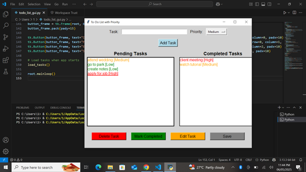

# Task 1: To-Do List App 📝

This project is part of my internship at **CODSOFT**. It’s a simple, functional **To-Do List Application** built using **Python** and **Tkinter**, focusing on user interaction, task management, and data persistence.

## 🔧 Features

- ✅ Add new tasks
- ❌ Delete tasks
- ✔️ Mark tasks as completed
- 💾 Data persistence using a `.txt` file
- 🎨 GUI built using Tkinter with a clean layout

## 💻 Technologies Used

- Python 🐍
- Tkinter (for GUI)
- File I/O for saving/loading tasks

## 🧠 What I Learned

- GUI layout and design with Tkinter
- Event-driven programming
- File handling and persistence
- Functional UI design

## 📸 Screenshot



## 📂 Folder Structure

```
Task1_TodoList/
│
├── todo_list_gui.py
├── tasks.json
├── screenshot.png
└── README.md
```

---
**#CODSOFT #Python #Tkinter #ToDoApp #InternshipProject**
