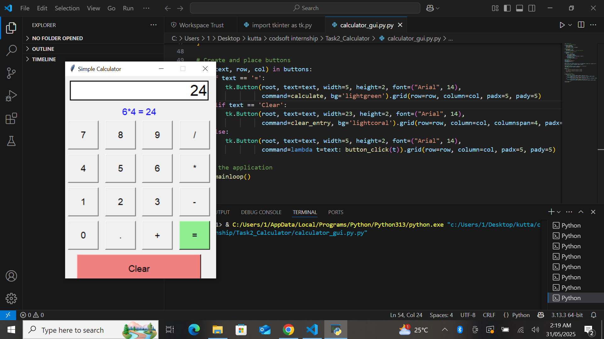

# Task 2: Calculator App 🔢

This project is part of my internship at **CODSOFT**. It’s a GUI Calculator application using **Python** and **Tkinter**, capable of performing basic arithmetic operations with a clean and interactive interface.

## 🔧 Features

- ➕ Addition
- ➖ Subtraction
- ✖️ Multiplication
- ➗ Division
- 🧼 Clear function
- 🖱 Button-based input via GUI

## 💻 Technologies Used

- Python 🐍
- Tkinter (for GUI)

## 🧠 What I Learned

- Event handling in GUI applications
- Designing intuitive user interfaces
- Logical structuring using `eval()` and command binding

## 📸 Screenshot



## 🔗 Live Demo
https://www.linkedin.com/posts/keerthanadinesh95_codsoft-pythondeveloper-tkinter-activity-7334637096554373121-g3kV?utm_source=share&utm_medium=member_desktop&rcm=ACoAACJsmkABU8WssLczGmkP_xntxUjnFbJF50Q

## 📂 Folder Structure

```
Task2_Calculator/
│
├── calculator_gui.py
├── screenshot.png
└── README.md
```

---
**#CODSOFT #Python #Tkinter #Calculator #InternshipProject**
