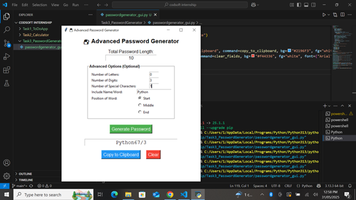

# 🔐 Advanced Password Generator – Python GUI (Tkinter)

## 💼 Internship Task 3 – CodSoft

This project is a secure, customizable **Password Generator GUI** application built using **Python and Tkinter**. It helps users generate strong, random passwords tailored to their personal or professional needs — with advanced options for customization.

---

## 🚀 Features

✨ **Simple + Advanced Modes**  
- 🔢 Set the **total length** of the password  
- 🔡 Specify number of **letters**, **digits**, and **special characters**  
- 🧠 Include any **name/word** in the password  
- ↪️ Choose where the word appears: **Start**, **Middle**, or **End**

⚠️ **Input Validation**
- Ensures the sum of letters, digits, and symbols (plus optional word) equals the total length  
- Displays error message if mismatch is detected  

🧪 **Other Highlights**
- ✔️ Instant password generation  
- 📋 Copy-to-clipboard function  
- 🔁 Clear/reset fields for fresh generation  
- 🖥️ Built with a clean, user-friendly **Tkinter GUI**

---

## 🧠 Tech Stack

- **Python 3.10+**
- **Tkinter** for GUI
- **random** for password logic
- **string** module for character sets

---

## 🖥️ How It Works

1. Launch the app via `python password_generator_gui.py`
2. Enter desired password **length**
3. (Optional) Click **Advanced Options** to:
   - Define character counts
   - Include a specific word
   - Choose word placement
4. Click **Generate Password**
5. Copy or clear as needed

---

## 📸 Demo Screenshot



---

## 🔗 Live Demo

https://www.linkedin.com/posts/keerthanadinesh95_python-gui-tkinter-activity-7334640123063533568-Q5eu?utm_source=share&utm_medium=member_desktop&rcm=ACoAACJsmkABU8WssLczGmkP_xntxUjnFbJF50Q

---

## 📂 Project Structure

```
Task3_PasswordGenerator/
├── password_generator_gui.py
├── README.md
├── screenshot.png
```

---

## ⚙️ To Run Locally

1. Clone the repository:
   ```
   git clone https://github.com/your-username/Task3_PasswordGenerator.git
   cd Task3_PasswordGenerator
   ```

2. Run the script:
   ```
   python password_generator_gui.py
   ```

> **Note**: Python 3.10 or above recommended.

---

## 🙋‍♀️ About Me

👩‍💻 **Keerthana Dinesh**  
AI/ML Enthusiast | CodSoft Intern | Exploring the world of intelligent systems.  
📫 [LinkedIn Profile](https://www.linkedin.com/in/keerthana-dinesh/)  
🔗 Portfolio/GitHub – Coming soon!

---

## 📜 License

This project is licensed under the MIT License. See `LICENSE` file for details.

---

## 🙌 Acknowledgements

- Thanks to **CodSoft** for the internship opportunity.
- Inspired by common password manager logic and real-world app needs.

---

### 🔐 Stay safe. Code smart. Build powerful.
